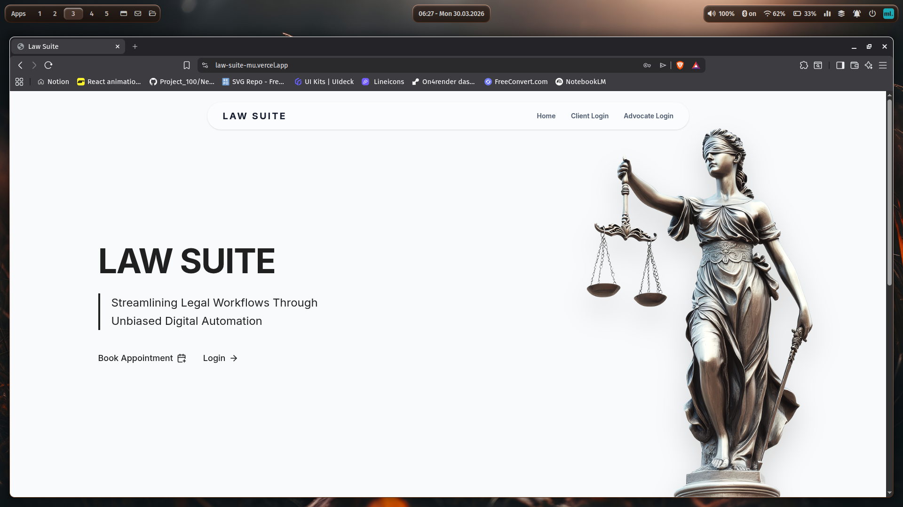
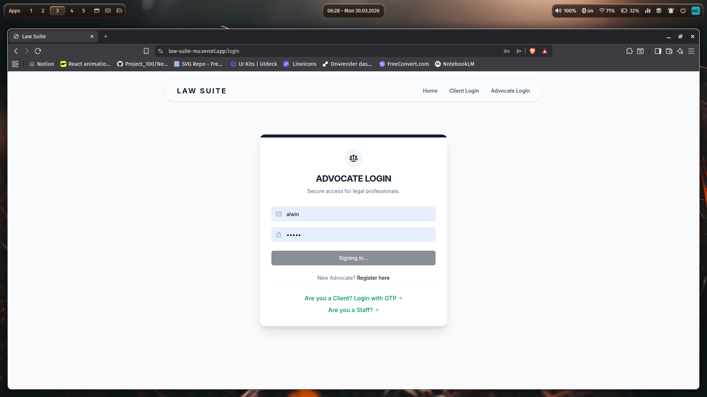
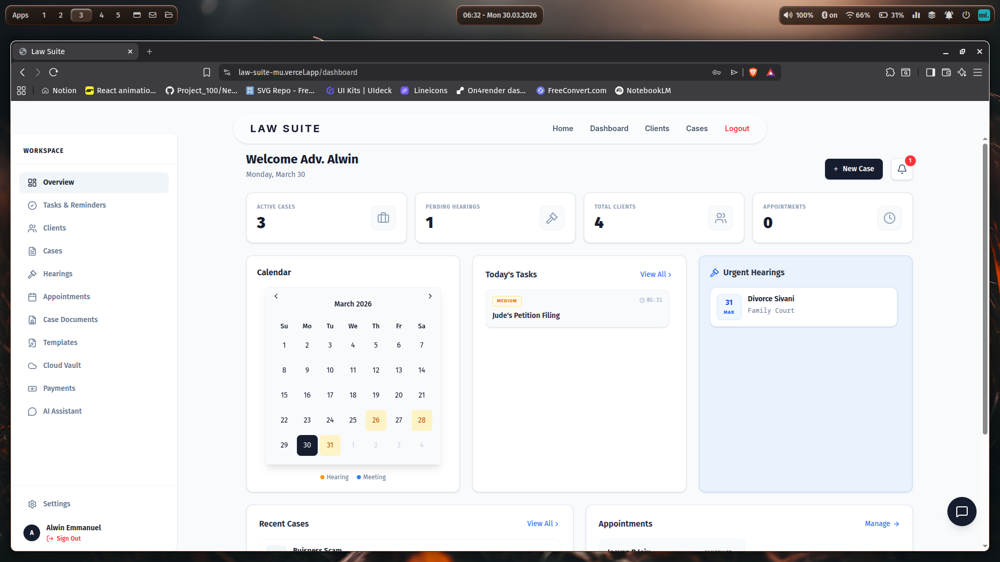
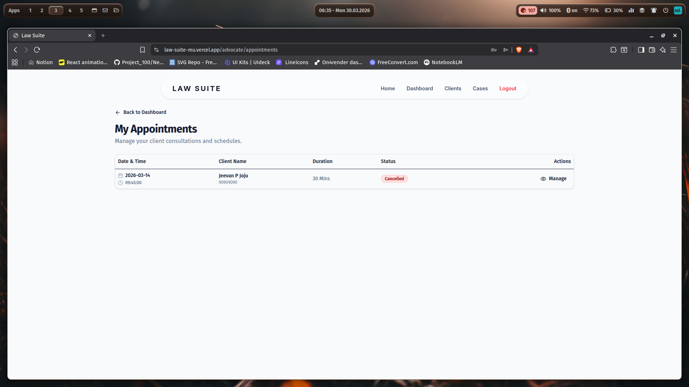
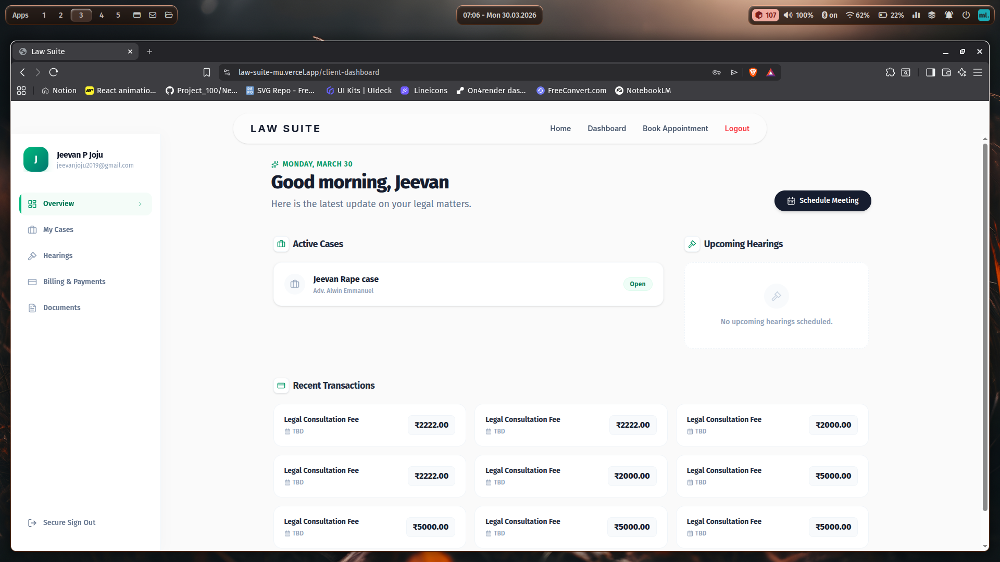
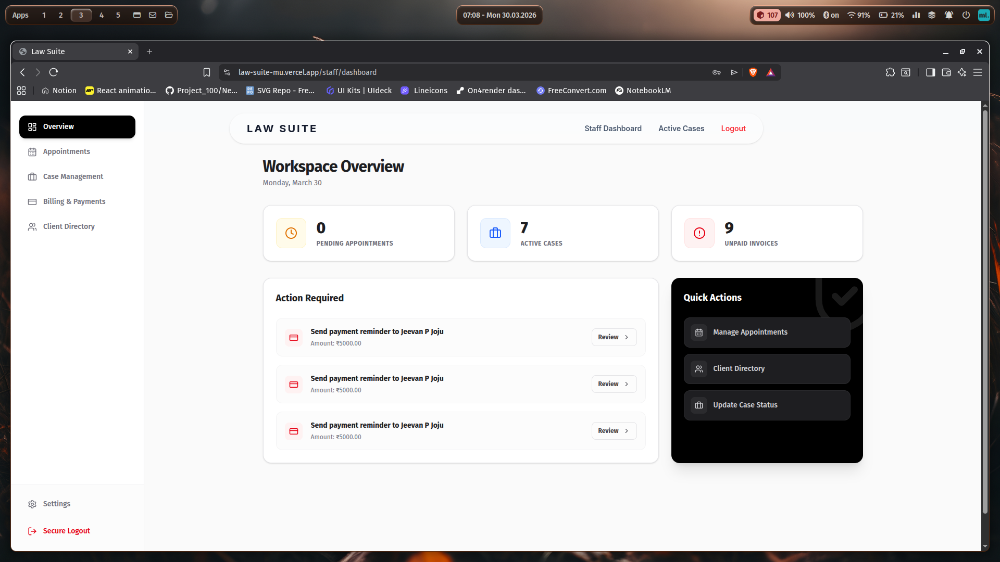

# Law Suite: Automated Digital Workspace for Advocates

> A centralized, secure, web-based practice management platform designed to digitize and streamline legal operations for advocates and small law firms.

This repository contains the engineering mini project **Automated Digital Workspace for Advocates**, developed by Team 10 (Alwin Emmanuel, Jeevan P Joju, Chrismilin Antony, Liz Joy) at AISAT, Kalamassery.   


---

## 📖 Table of Contents
- [About the Project](#-about-the-project)
- [Key Features](#-key-features)
- [Technologies Used](#-technologies-used)
- [System Architecture](#-system-architecture)
- [Installation & Setup](#-installation--setup)
- [Project Snapshots](#-project-snapshots)
- [Video Demo](#-video-demo)
- [Team Contributions](#-team-contributions)

---

## 🎯 About the Project

### The Problem
Advocates and small law firms often rely on highly fragmented, paper-based methods for managing their practice. This leads to inefficient case tracking, missed deadlines, poor record-keeping, and disjointed payment monitoring. Existing digital solutions are often too expensive or complex for smaller practices.

### The Solution
**Law Suite** bridges this gap by providing an affordable, intuitive digital workspace. It brings client management, case tracking, document storage, automated reminders, and financial monitoring under one unified, secure platform with strict role-based access controls.

---

## ✨ Key Features

- **👥 Client & Case Management:** Comprehensive CRUD operations for client profiles and case histories.
- **📅 Smart Scheduling & Reminders:** Integrated calendar with an automated alert system for upcoming hearings, deadlines, and pending payments.
- **📄 Document & Template Vault:** Secure cloud storage for case files and a library of ready-to-use, editable legal templates.
- **💳 Financial Tracking:** Monitor accounts receivable and process online payments seamlessly.
- **🔐 Role-Based Access Control (RBAC):** Tailored dashboards and permissions for Advocates, Staff, and Clients.
- **🤖 AI-Powered Legal Assistant:** A context-aware AI chatbot that queries real-time case statuses, hearings, and client details directly from the database, eliminating AI hallucinations.

---

## 🛠 Technologies Used

### Frontend
- **React 18.x** (UI Development)
- **Tailwind CSS & Shadcn UI** (Styling & Components)
- **Vercel** (Hosting)

### Backend
- **Django 4.x & Django REST Framework** (API & Server Logic)
- **Render** (Hosting)

### Database & Cloud Services
- **PostgreSQL 13+** hosted on **Neon** (ACID Compliant Database)
- **Cloudinary** (Object Storage for PDF/Media documents)
- **Razorpay API** (Payment Gateway Integration - Test Mode)
- **Brevo API** (Automated Email Notifications)

---

## 🏗 System Architecture
- **Performance:** Optimized queries, <4s page load, supports 20+ concurrent users.
- **Architecture:** Decoupled RESTful API architecture ensuring smooth client-server communication.
- **Compliance Considerations:** Built with respect to IT Act 2000 and Bar Council of India client confidentiality rules.

---

## 🚀 Installation & Setup

To run this project locally, follow these steps:

### 1. Clone the Repository
```bash
git clone [https://github.com/Alwin42/Law-Suite.git](https://github.com/Alwin42/Law-Suite.git)
cd Law-Suite
```
### 2. Backend setup - Django
```
cd backend

# Create and activate virtual environment
python -m venv venv
# On Windows use: venv\Scripts\activate
# On Linux/Mac use: source venv/bin/activate

# Install dependencies
pip install -r requirements.txt

# Run migrations and start the server
python manage.py migrate
python manage.py runserver
```
### 3. Fronted setup - REACT
```
# Open a new terminal and navigate to frontend
cd frontend

# Install dependencies
npm install

# Start the development server
npm start
```

---
## 9. Snapshots

<p align="center">
  
  
</p>

<p align="center">
  
  
</p>

<p align="center">
  
  
</p>

--- 


## 10.  Video Demo

*(Insert Link to YouTube or embedded video file here)*

---

##  Team Contributions

| Team Member | Core Responsibilities |
| --- | --- |
| **Alwin Emmanuel** | Full-Stack Development, REST API Integration, Database Architecture. |
| **Jeevan P Joju** | Project Documentation, UI/UX Design & Component Architecture. |
| **Chrismilin Antony** | Quality Assurance, Testing, and Cloud Deployment. |
| **Liz Joy** | Frontend Development,  Presentation, and Team Coordination. |

